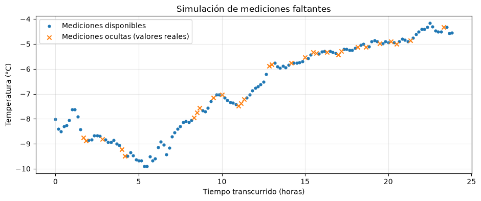
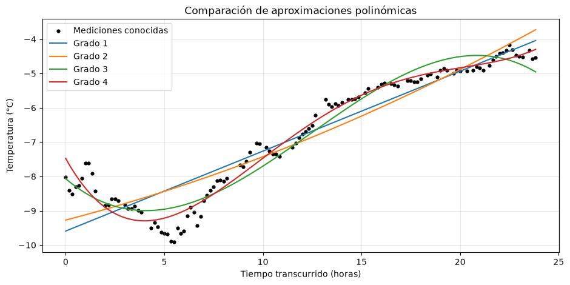
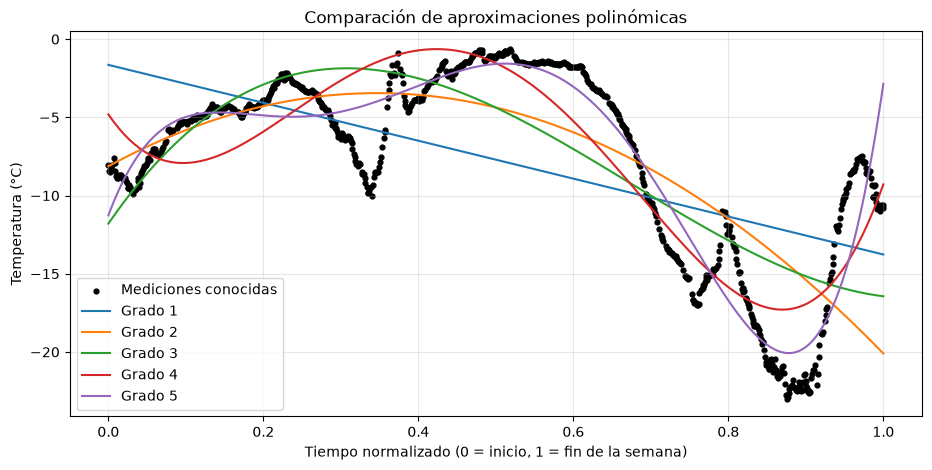

# Reconstrucción de mediciones meteorológicas faltantes mediante métodos numéricos

**Trabajo de investigación — Cálculo Numérico**  
Licenciatura en Matemática · Universidad Abierta Interamericana

## 1. Introducción

La ausencia de mediciones es un problema frecuente en el tratamiento de datos experimentales. Fallas en sensores, interrupciones en los sistemas de adquisición o errores de almacenamiento pueden producir registros incompletos, dificultando el análisis de los fenómenos observados.

Este trabajo estudia la reconstrucción de mediciones faltantes de temperatura mediante dos métodos numéricos: la **aproximación polinómica por mínimos cuadrados** y la **interpolación polinómica de Newton por diferencias divididas**.

Se utiliza un conjunto de datos meteorológicos reales, originalmente completo para las variables seleccionadas, del cual se oculta deliberadamente una proporción de las temperaturas. Como se conservan los valores originales, es posible evaluar cuantitativamente la precisión de las reconstrucciones.

El objetivo principal es comparar ambos métodos y analizar cómo influyen el grado del polinomio y la extensión del intervalo temporal en los resultados.

## 2. Definición del problema

Se dispone de un conjunto de observaciones:

\[
D=\{(x_i,y_i)\}_{i=1}^{n}
\]

donde:

- \(x_i\) representa el tiempo transcurrido desde el comienzo del período estudiado.
- \(y_i\) representa la temperatura del aire, expresada en grados Celsius.

Se selecciona aleatoriamente un subconjunto de observaciones y se ocultan sus valores de temperatura, conservando las coordenadas temporales correspondientes.

El problema consiste en estimar cada temperatura faltante \(\hat y_i\) utilizando exclusivamente las mediciones disponibles.

Una vez reconstruidos los valores, se comparan las estimaciones con las temperaturas originales para determinar el error de cada método.

**Pregunta de investigación:**

> ¿Con qué precisión pueden reconstruirse mediciones faltantes de temperatura mediante aproximación polinómica por mínimos cuadrados e interpolación polinómica de Newton, y cómo cambia su desempeño al modificar el grado del polinomio y la extensión del intervalo estudiado?

## 3. Dataset utilizado

Se utiliza el **Jena Climate Dataset**, compuesto por registros meteorológicos de una estación del Instituto Max Planck de Biogeoquímica, ubicada en Jena, Alemania.

El archivo `jena_climate_2009_2016.csv` contiene 420.551 observaciones y 15 columnas, correspondientes a marcas temporales y variables meteorológicas.

Para este estudio se seleccionan únicamente:

| Columna original | Variable | Descripción |
|---|---|---|
| `Date Time` | \(x\) | Fecha y hora de la medición, transformada en tiempo numérico |
| `T (degC)` | \(y\) | Temperatura del aire en °C |

La exploración inicial confirmó que ambas columnas contienen 420.551 valores no nulos.

El estudio es deliberadamente univariado: la reconstrucción se realiza considerando la temperatura como función del tiempo, sin incorporar otras variables meteorológicas.

**Fuente:** [Jena Climate Dataset — Kaggle](https://www.kaggle.com/datasets/mnassrib/jena-climate)

### 3.1. Selección del intervalo

El experimento principal utiliza las primeras **24 horas de mediciones**, correspondientes a 144 observaciones consecutivas, tomadas cada diez minutos.

Se define la variable independiente como el tiempo transcurrido en horas:

\[
x_i=\frac{t_i-t_0}{3600}
\]

donde \(t_i-t_0\) se expresa en segundos.

Posteriormente, se realiza un experimento complementario con una ventana de **siete días**, equivalente a 1.008 observaciones.

En el experimento semanal, la variable temporal se normaliza al intervalo \([0,1]\) para mejorar la escala numérica de las potencias utilizadas en los ajustes polinómicos.

### 3.2. Simulación de mediciones faltantes

Para simular la pérdida de registros se oculta aleatoriamente el 20 % de los valores de temperatura, manteniendo intactas las fechas.

Se utiliza un generador pseudoaleatorio con semilla fija `42`, de manera que el experimento pueda reproducirse.

| Característica | 24 horas | 7 días |
|---|---:|---:|
| Observaciones totales | 144 | 1.008 |
| Mediciones disponibles | 115 | 806 |
| Mediciones ocultas | 29 | 202 |
| Porcentaje ocultado | ≈ 20 % | ≈ 20 % |
| Semilla aleatoria | 42 | 42 |

Los valores originales se conservan por separado y se utilizan únicamente durante la evaluación.



*Figura 1. Distribución de las mediciones conocidas y ocultas. Los puntos representan temperaturas disponibles y las cruces identifican los valores originales seleccionados para su reconstrucción. Estos últimos se muestran únicamente con fines de visualización y validación.*

## 4. Solución principal: aproximación polinómica por mínimos cuadrados

El método de mínimos cuadrados permite encontrar una función que aproxime un conjunto de observaciones, minimizando la suma de los cuadrados de las diferencias entre los valores medidos y los estimados.

Para un polinomio de grado \(d\), se considera:

\[
P_d(x)=a_0+a_1x+a_2x^2+\cdots+a_dx^d
\]

Los coeficientes \(a_0,\ldots,a_d\) se determinan minimizando:

\[
E(a_0,\ldots,a_d)=
\sum_{i=1}^{m}
\left(y_i-P_d(x_i)\right)^2
\]

donde \(m\) es la cantidad de mediciones disponibles.

### 4.1. Formulación matricial

El problema puede expresarse mediante la matriz de diseño:

\[
A=
\begin{pmatrix}
1 & x_1 & x_1^2 & \cdots & x_1^d\\
1 & x_2 & x_2^2 & \cdots & x_2^d\\
\vdots & \vdots & \vdots & & \vdots\\
1 & x_m & x_m^2 & \cdots & x_m^d
\end{pmatrix}
\]

y los vectores:

\[
a=
\begin{pmatrix}
a_0\\a_1\\\vdots\\a_d
\end{pmatrix},
\qquad
y=
\begin{pmatrix}
y_1\\y_2\\\vdots\\y_m
\end{pmatrix}
\]

Se busca minimizar:

\[
\|Aa-y\|_2^2
\]

Las ecuaciones normales asociadas son:

\[
A^TAa=A^Ty
\]

En la implementación se utiliza `numpy.linalg.lstsq`, que resuelve directamente el problema de mínimos cuadrados sin necesidad de formar explícitamente \(A^TA\), evitando parte de los problemas de estabilidad numérica asociados a las ecuaciones normales.

La matriz de diseño se construye explícitamente a partir de las potencias de las observaciones temporales.

### 4.2. Evaluación de grados polinómicos

Se ajustaron polinomios de grados 1 a 9, utilizando exclusivamente las mediciones disponibles.

Para cada grado se realizaron los siguientes pasos:

1. Construir la matriz de diseño.
2. Calcular los coeficientes mediante mínimos cuadrados.
3. Evaluar el polinomio en las posiciones temporales de las mediciones ocultas.
4. Comparar las estimaciones con las temperaturas originales.
5. Calcular las métricas de error.

El análisis se inició con grados 1 a 4 y posteriormente se amplió hasta grado 9 para explorar el efecto de una mayor complejidad polinómica.



*Figura 2. Ajustes polinómicos sobre las mediciones disponibles del intervalo de 24 horas. Se muestran únicamente los grados 1 a 4 para facilitar la visualización. Los grados 5 a 9 también fueron evaluados numéricamente.*

### 4.3. Interpretación

Los polinomios de menor grado representan principalmente la tendencia general de la temperatura, mientras que los de mayor grado permiten incorporar cambios adicionales de curvatura.

Sin embargo, aumentar el grado no garantiza una mejor reconstrucción de mediciones desconocidas.

Un polinomio puede ajustarse mejor a las observaciones utilizadas para calcular sus coeficientes sin reducir necesariamente el error sobre los datos ocultos.

Por esta razón, la comparación se realiza utilizando errores de reconstrucción y no únicamente el ajuste visual.

## 5. Solución alternativa: interpolación de Newton

Como segunda estrategia se utiliza la **interpolación polinómica de Newton por diferencias divididas**.

A diferencia de mínimos cuadrados, que ajusta un único polinomio global, este procedimiento construye un polinomio local para cada temperatura faltante.

Se seleccionan los cuatro nodos conocidos temporalmente más cercanos a cada posición que debe reconstruirse.

Con cuatro nodos distintos se obtiene un polinomio interpolante de grado a lo sumo 3.

### 5.1. Formulación matemática

El polinomio de Newton se expresa como:

\[
I_3(x)=f[x_0]
+f[x_0,x_1](x-x_0)
\]

\[
+f[x_0,x_1,x_2](x-x_0)(x-x_1)
\]

\[
+f[x_0,x_1,x_2,x_3](x-x_0)(x-x_1)(x-x_2)
\]

Los coeficientes se obtienen mediante diferencias divididas:

\[
f[x_i,\ldots,x_{i+j}]
=
\frac{
f[x_{i+1},\ldots,x_{i+j}]
-
f[x_i,\ldots,x_{i+j-1}]
}{
x_{i+j}-x_i
}
\]

El polinomio cumple la condición de interpolación:

\[
I_3(x_i)=y_i
\]

para los cuatro nodos seleccionados.

### 5.2. Procedimiento de reconstrucción

Para cada medición faltante:

1. Identificar su posición temporal.
2. Calcular las distancias respecto de las mediciones conocidas.
3. Seleccionar los cuatro nodos temporalmente más cercanos.
4. Ordenar los nodos según su coordenada temporal.
5. Calcular los coeficientes por diferencias divididas.
6. Evaluar el polinomio de Newton en la posición del dato faltante.

Se implementaron explícitamente tanto el cálculo de diferencias divididas como la evaluación del polinomio mediante su forma anidada.

Este procedimiento se repite de manera independiente para todas las mediciones ocultas.

## 6. Evaluación y métricas de error

Ambos métodos se evalúan sobre exactamente las mismas posiciones temporales y las mismas temperaturas ocultas en cada experimento.

Se utilizan dos métricas.

### 6.1. Error absoluto medio (MAE)

\[
MAE=\frac{1}{n}\sum_{i=1}^{n}|y_i-\hat y_i|
\]

Representa la magnitud media de los errores, expresada directamente en °C.

### 6.2. Error cuadrático medio (MSE)

\[
MSE=\frac{1}{n}\sum_{i=1}^{n}(y_i-\hat y_i)^2
\]

Penaliza más intensamente las diferencias grandes y se utiliza como métrica principal para comparar las configuraciones.

En ambos casos, valores menores indican una reconstrucción más precisa.

### 6.3. Resultados del experimento de 24 horas

| Método | MAE (°C) | MSE (°C²) |
|---|---:|---:|
| Mínimos cuadrados — grado 1 | 0,3478 | 0,1719 |
| Mínimos cuadrados — grado 2 | 0,3837 | 0,2259 |
| Mínimos cuadrados — grado 3 | 0,3453 | 0,1607 |
| Mínimos cuadrados — grado 4 | 0,2225 | 0,0740 |
| Mínimos cuadrados — grado 5 | 0,2154 | 0,0769 |
| Mínimos cuadrados — grado 6 | 0,2340 | 0,0892 |
| Mínimos cuadrados — grado 7 | 0,2554 | 0,0949 |
| Mínimos cuadrados — grado 8 | 0,2284 | 0,0848 |
| Mínimos cuadrados — grado 9 | 0,2307 | 0,0859 |
| **Newton — 4 nodos** | **0,0485** | **0,0036** |

Entre los polinomios globales, el grado 4 obtuvo el menor MSE (0,0740 °C²), mientras que el grado 5 obtuvo el menor MAE (0,2154 °C).

Esto evidencia que la selección de una configuración depende también de la métrica empleada.

Asimismo, el grado 2 presentó un MSE mayor que el grado 1, lo cual demuestra que el aumento del grado no implica necesariamente una reducción del error de reconstrucción.

Por su parte, Newton con cuatro nodos obtuvo un MSE de 0,0036 °C² y un MAE de 0,0485 °C, superando ampliamente a los ajustes globales evaluados en este experimento.

La explicación principal se relaciona con el carácter local de la interpolación: al reconstruir mediciones aisladas separadas por intervalos de diez minutos, existen observaciones conocidas muy próximas a los valores ocultos.

## 7. Experimento complementario: ampliación a una semana

Para explorar el comportamiento de los métodos sobre un intervalo temporal más extenso, se repitió el procedimiento utilizando las primeras 1.008 mediciones, equivalentes a siete días.

Se mantuvieron las condiciones generales del experimento:

- Ocultamiento aleatorio del 20 % de las temperaturas.
- Semilla pseudoaleatoria fija `42`.
- Polinomios de mínimos cuadrados de grados 1 a 9.
- Interpolación local de Newton con cuatro nodos.
- Evaluación mediante MAE y MSE.

La variable temporal se normalizó al intervalo \([0,1]\) para mejorar la escala numérica del ajuste polinómico.



*Figura 3. Aproximación global de las temperaturas observadas durante siete días mediante polinomios de distintos grados. Se aprecian variaciones más complejas que las presentes en el intervalo original de 24 horas.*

### 7.1. Resultados

| Método | MAE (°C) | MSE (°C²) |
|---|---:|---:|
| Mínimos cuadrados — grado 1 | 3,9231 | 21,4141 |
| Mínimos cuadrados — grado 2 | 2,7528 | 13,0088 |
| Mínimos cuadrados — grado 3 | 2,7766 | 12,6115 |
| Mínimos cuadrados — grado 4 | 2,4884 | 8,8437 |
| Mínimos cuadrados — grado 5 | 1,5351 | 4,3044 |
| Mínimos cuadrados — grado 6 | 1,5256 | 4,1805 |
| Mínimos cuadrados — grado 7 | 1,2884 | 3,5245 |
| Mínimos cuadrados — grado 8 | 1,2897 | 3,4598 |
| Mínimos cuadrados — grado 9 | 1,3338 | 3,3994 |
| **Newton — 4 nodos** | **0,0790** | **0,0203** |

### 7.2. Análisis

Al ampliar el intervalo temporal se observó un aumento importante del error de los polinomios globales.

Para siete días, el mejor resultado de mínimos cuadrados según MSE correspondió al grado 9, con un valor de 3,3994 °C².

El comportamiento térmico durante una semana presentó variaciones que resultaron difíciles de representar mediante un único polinomio global de los grados evaluados.

En cambio, Newton obtuvo un MSE de 0,0203 °C², manteniendo una precisión relativamente alta.

Este resultado es coherente con la naturaleza local de la interpolación: aunque el intervalo total aumentó, la frecuencia de las mediciones permaneció constante y los nodos disponibles siguieron estando próximos a muchas de las posiciones faltantes.

Sin embargo, los experimentos utilizan diferentes cantidades y posiciones de observaciones ocultas. Por lo tanto, la diferencia entre sus métricas no puede atribuirse exclusivamente a la duración del intervalo temporal.

## 8. Comparación de enfoques

| Característica | Mínimos cuadrados | Interpolación de Newton |
|---|---|---|
| Tipo de aproximación | Global | Local |
| Observaciones utilizadas | Todas las disponibles | Cuatro nodos cercanos |
| Condición sobre los nodos | Minimiza residuos cuadrados | Pasa exactamente por los nodos seleccionados |
| Grado evaluado | 1 a 9 | Hasta 3 |
| Ventaja principal | Representa tendencias generales | Reconstruye variaciones locales |
| Limitación principal | Puede perder detalles locales | Puede ser sensible al ruido y a la selección de nodos |

La comparación no enfrenta métodos de idéntico alcance: mínimos cuadrados utiliza todas las observaciones disponibles para construir un único polinomio, mientras que Newton construye un interpolante diferente para cada valor faltante.

En consecuencia, los resultados deben entenderse como una comparación entre dos estrategias concretas de reconstrucción, no como una demostración de superioridad universal de un método sobre otro.

## 9. Limitaciones

El estudio presenta las siguientes limitaciones:

**Relación univariada.** La temperatura se modela exclusivamente como función del tiempo. En situaciones reales también intervienen otras variables, como presión atmosférica, humedad, radiación solar y condiciones meteorológicas generales.

**Valores faltantes dispersos.** El ocultamiento aleatorio genera principalmente pérdidas aisladas de mediciones. No se evalúa específicamente la reconstrucción de intervalos prolongados sin registros.

**Selección de parámetros.** Los grados polinómicos y la cantidad de nodos se establecieron para explorar configuraciones concretas. No se realizó una optimización exhaustiva de hiperparámetros.

**Validación.** Los mismos valores ocultos se utilizan para comparar los distintos grados y seleccionar el mejor. Por ello, el error del grado seleccionado constituye una estimación sobre el conjunto experimental utilizado, y no una evaluación independiente sobre nuevos datos.

**Alcance temporal.** Se analizan las primeras 24 horas y los primeros siete días del dataset. Los resultados no necesariamente representan el comportamiento de otras estaciones del año ni de otros períodos meteorológicos.

**Sensibilidad al ruido.** La interpolación reproduce exactamente las mediciones utilizadas como nodos, incluso si contienen perturbaciones o errores instrumentales.

## 10. Herramientas e implementación

El proyecto se desarrolla en Python utilizando:

- `pandas`: lectura del dataset, manipulación de columnas y selección de observaciones.
- `numpy`: operaciones matriciales, cálculos numéricos y generación pseudoaleatoria.
- `matplotlib`: visualización de temperaturas, aproximaciones y resultados.
- Jupyter Notebook: organización y ejecución reproducible de los experimentos.

Se implementaron explícitamente los componentes matemáticos principales:

- Construcción de la matriz de diseño polinómica.
- Evaluación de polinomios.
- Cálculo de diferencias divididas de Newton.
- Evaluación anidada del interpolante.
- Selección de nodos cercanos.
- Cálculo de errores MAE y MSE.

Para la resolución del problema lineal de mínimos cuadrados se utiliza `numpy.linalg.lstsq`.

### Estructura del repositorio

```text
parcial-1/
├── notebooks/
│   ├── experimento_24h.ipynb
│   └── experimento_1semana.ipynb
├── resultados/
│   ├── resultados_24h.csv
│   └── resultados_1semana.csv
├── images/
│   ├── fig1_mediciones_faltantes_24h.png
│   ├── fig2_polinomios_24h.png
│   └── fig3_polinomios_1semana.png
├── raw-data/
│   └── jena_climate_2009_2016.csv
├── requirements.txt
├── README.md
└── borrador_punto5_calculo_numerico.md
```

Las tablas CSV permiten conservar los resultados obtenidos en ambos intervalos y realizar comparaciones sin sobrescribir las mediciones anteriores.

El notebook contiene el desarrollo computacional de los métodos y las visualizaciones utilizadas en el análisis.

### Cómo ejecutar el proyecto

Se requiere Python 3.12 o superior.

1. Clonar el repositorio y ubicarse en la carpeta del proyecto.

2. Crear y activar un entorno virtual, e instalar las dependencias:

   ```bash
   python3 -m venv venv
   source venv/bin/activate        # En Windows: venv\Scripts\activate
   pip install -r requirements.txt
   ```

3. Descargar el archivo `jena_climate_2009_2016.csv` desde [Kaggle](https://www.kaggle.com/datasets/mnassrib/jena-climate) y guardarlo en la carpeta `raw-data/`. El dataset no se incluye en el repositorio por su tamaño (42 MB).

4. Abrir los notebooks con Jupyter o con la extensión de Jupyter de VS Code, seleccionando el kernel del entorno virtual creado:

   - `notebooks/experimento_24h.ipynb`: experimento principal de 24 horas.
   - `notebooks/experimento_1semana.ipynb`: experimento complementario de siete días.

   Si se utiliza Jupyter clásico, instalarlo con `pip install jupyter` y ejecutar `jupyter notebook` desde la raíz del proyecto.

5. Ejecutar todas las celdas en orden. Los notebooks leen el dataset con la ruta relativa `../raw-data/`, por lo que deben ejecutarse desde la carpeta `notebooks/`, que es el comportamiento por defecto al abrirlos. Al finalizar, cada notebook exporta su tabla de errores a un archivo CSV dentro de `resultados/`.

Para evaluar polinomios de grados 1 a 9 en lugar de 1 a 4, cambiar `range(1, 5)` por `range(1, 10)` en las dos celdas indicadas con un comentario en cada notebook.

## 11. Conclusiones

El experimento permitió aplicar y comparar dos métodos numéricos para reconstruir mediciones meteorológicas faltantes a partir de datos reales.

La aproximación polinómica por mínimos cuadrados resultó adecuada para representar tendencias generales, especialmente en el intervalo de 24 horas, donde el grado 4 alcanzó el menor error cuadrático medio entre los polinomios evaluados.

Sin embargo, el incremento del grado no produjo mejoras sistemáticas en la reconstrucción. Además, al extender el intervalo de estudio a una semana, los errores de aproximación global aumentaron considerablemente.

Por su parte, la interpolación local de Newton con cuatro nodos obtuvo los menores errores en ambos experimentos. Su desempeño se explica, en parte, por la proximidad temporal entre las mediciones conocidas y los valores faltantes.

Los resultados muestran que **la conveniencia de un método numérico depende de las características del problema**. En este caso, la reconstrucción de mediciones aisladas favoreció a la interpolación local, mientras que mínimos cuadrados permitió estudiar el comportamiento general de los datos mediante modelos polinómicos de distinta complejidad.

Finalmente, el trabajo evidencia la importancia de evaluar los métodos mediante errores calculados sobre observaciones no utilizadas en la construcción de las aproximaciones, en lugar de basarse exclusivamente en la apariencia visual del ajuste.

---

**Fuente de datos:** Jena Climate Dataset — Instituto Max Planck de Biogeoquímica.

**Ámbito académico:** Primer parcial de Cálculo Numérico, Licenciatura en Matemática, Universidad Abierta Interamericana.